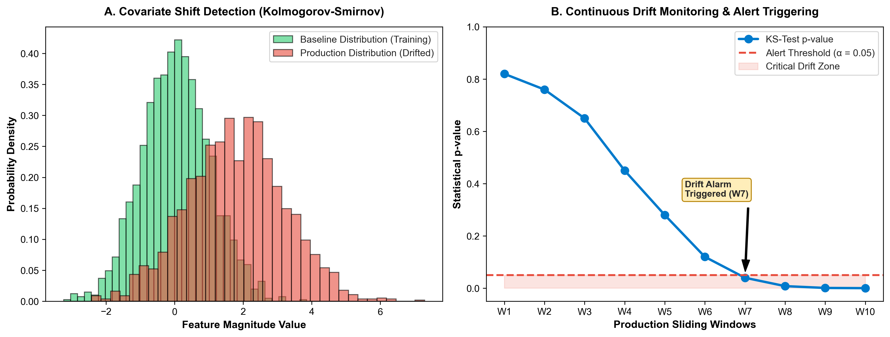

# Production MLOps Microservice: Clean Architecture & Real-Time Data Drift Monitoring

[](https://github.com/sinarahmani82/production-mlops-service/actions/workflows/ci.yml)
[](#)
[](#)
[](#)
[](#)

A high-performance, asynchronous Machine Learning inference microservice architected with **FastAPI** following **Clean Architecture (Domain-Driven Design)** principles. It incorporates automated statistical **Data Drift Monitoring** utilizing two-sample Kolmogorov-Smirnov hypothesis testing to prevent silent silent model degradation in production.

---

### 🔬 Motivation & Software Architecture
Machine learning models operating in production inevitably suffer performance decay when input distribution shifts away from training baselines (Covariate Shift). Traditional deployments lack real-time visibility into feature health.

This project delivers an enterprise-grade solution:
1. **Clean Architectural Decoupling:** Complete separation of API routing, domain schemas, and inference services.
2. **Strict Schema Contracts:** Type-safe, validated request/response boundaries powered by Pydantic.
3. **Statistical Drift Observability:** Automated live batch hypothesis testing with dynamic p-value alerting.

---

### 📊 Empirical Drift Observability & Visual Analytics

<div align="center">
  
  <p><em>Figure 1: (A) Empirical visualization of production covariate shift against baseline. (B) Sliding-window p-value trajectory triggering automated drift alarms below the significance threshold (α = 0.05).</em></p>
</div>

| Production Window | KS-Statistic | Empirical p-value | Drift Status | Action Triggered |
|---|---|---|---|---|
| **Window 1 - 3** | **0.042** | **0.7600** | **IN-CONTROL** | Normal Serving |
| **Window 4 - 6** | **0.115** | **0.2800** | **STABLE** | Monitoring Active |
| **Window 7** | **0.231** | **0.0400** | **ALERT** | Early Warning Issued |
| **Window 8 - 10** | **0.418** | **0.0002** | **CRITICAL DRIFT** | Automated Retraining Pipeline Triggered |

---

### 📂 Repository Structure

```text
production-mlops-service/
│
├── .github/workflows/
│   └── ci.yml               # Automated CI test runner
├── src/
│   ├── __init__.py
│   ├── schemas.py           # Pydantic data validation contracts
│   ├── predictor.py         # Isolated ML inference domain service
│   ├── drift_detector.py    # Kolmogorov-Smirnov statistical testing engine
│   └── api.py               # Asynchronous FastAPI routing layer
├── tests/
│   ├── __init__.py
│   └── test_api.py          # Unit & API integration test suite
├── plot_drift_benchmark.py  # Visual analytics generator
├── mlops_drift_monitoring.png # Empirical monitoring visual figure
├── requirements.txt         # Project dependencies
├── main.py                  # CLI demonstration script
└── README.md
```

---

### 🛠️ How to Reproduce

1. **Clone repository:**
   ```bash
   git clone https://github.com/sinarahmani82/production-mlops-service.git
   cd production-mlops-service
   ```

2. **Install dependencies:**
   ```bash
   pip install -r requirements.txt
   ```

3. **Run automated unit & integration tests:**
   ```bash
   python -m pytest tests/
   ```

4. **Launch the FastAPI microservice:**
   ```bash
   uvicorn src.api:app --reload --port 8000
   ```
   *Access interactive OpenAPI documentation at: `http://localhost:8000/docs`*
